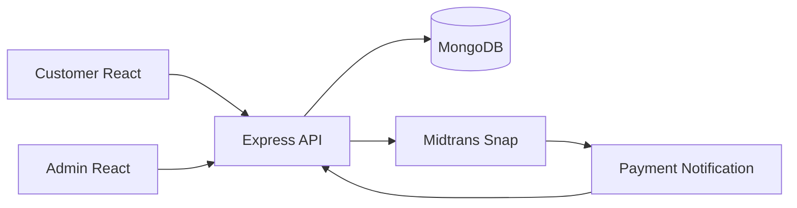
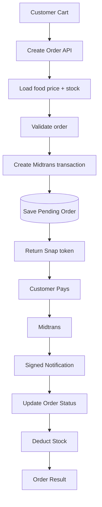
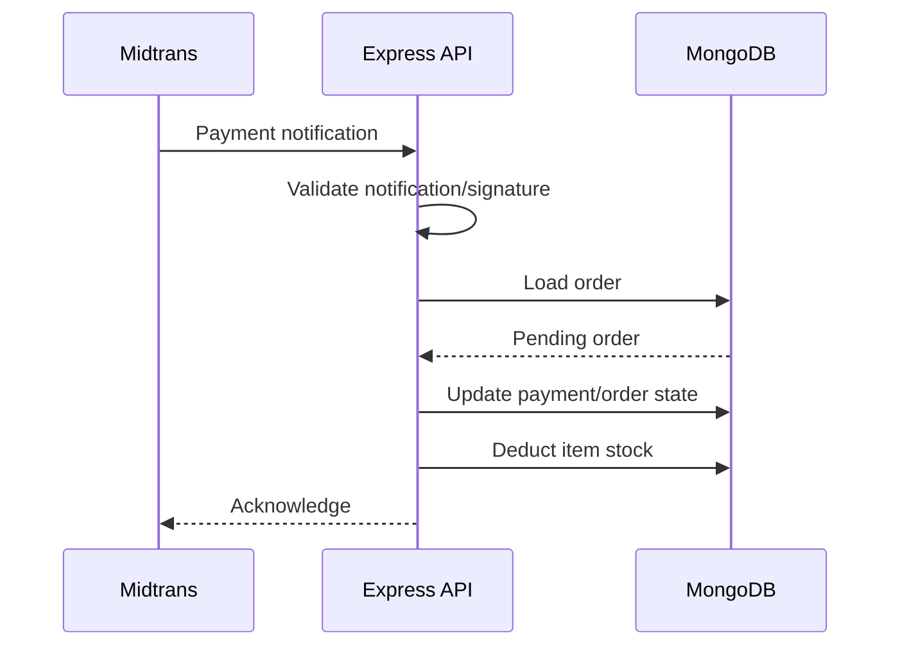
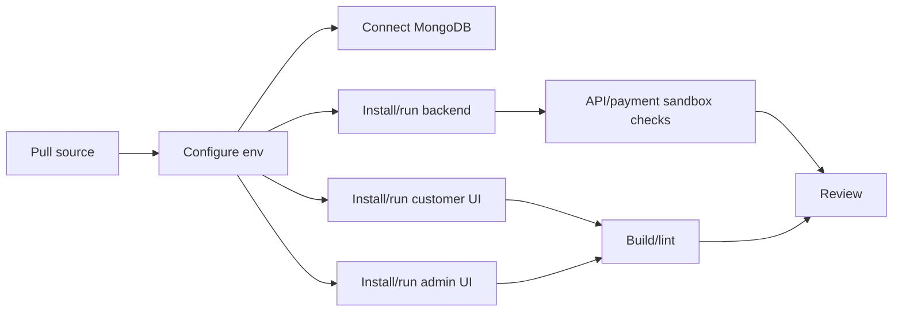
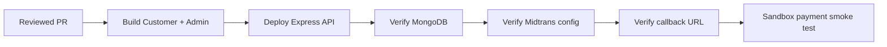

# kantinpintarv2 — Development Pipeline

> Code-grounded architecture and delivery guide for the current repository snapshot. Reviewed from `main` at `1188cfd98fc8` on 2026-09-17.

KantinPintar combines a customer React app, an admin React app, an Express API, MongoDB, and Midtrans Snap payments.

## 1. System architecture

## 2. Order-to-payment pipeline

## 3. Payment callback flow

Payment status and stock are separate writes spanning external and database systems. Duplicate and concurrent callbacks must be treated as a release-critical scenario.

## 4. Runtime ownership

| Layer | Responsibility | Key source |
| --- | --- | --- |
| Customer frontend | Menu, cart, customer orders | `frontend/` |
| Admin frontend | Administrative order/menu workflows | `admin/` |
| Express | API entrypoint and domain routing | `backend/server.js` |
| Order controller | Pricing, payment, status, stock | `backend/controllers/orderController.js` |
| Admin auth | Admin authorization | `backend/middleware/authAdminMiddleware.js` |
| MongoDB | Users, food, carts, orders | Mongoose models |
| Midtrans | Payment transaction + notification | External payment service |

## 5. Development pipeline

| Directory | Command | Purpose |
| --- | --- | --- |
| `backend` | `npm run dev` | Run API with nodemon |
| `backend` | `npm run start` | Start API |
| `frontend` | `npm run dev` | Customer UI |
| `frontend` | `npm run build` | Customer production build |
| `frontend` | `npm run lint` | Customer lint |
| `admin` | `npm run dev` | Admin UI |
| `admin` | `npm run build` | Admin production build |
| `admin` | `npm run lint` | Admin lint |

## 6. Verification gates

Use Midtrans sandbox and synthetic data to validate:

- Product price is loaded server-side rather than trusted from the browser.
- Insufficient stock.
- Invalid or tampered payment notification.
- Duplicate payment notification.
- Two callbacks arriving near-simultaneously.
- Order state transition after successful payment.
- Stock deducted once only.
- Customer can read only their own orders.
- Admin/customer authorization separation.
- Failed payment and expired transaction states.

## 7. Release pipeline

No `.github/workflows/` automation was found in the reviewed snapshot.

## 8. Known gaps

1. Stock deduction uses per-item writes plus an order flag; this alone does not establish concurrency-safe exactly-once processing.
2. Payment and database updates span different systems and require idempotency-focused testing.
3. No conventional automated test suite was identified in the reviewed tree.
4. CI is not currently represented by GitHub Actions in this snapshot.

## 9. Source map

- [`backend/server.js`](https://github.com/HidayahMF/kantinpintarv2/blob/1188cfd98fc8bd6ed4c57b19cd1f674e7321358b/backend/server.js)
- [`backend/controllers/orderController.js`](https://github.com/HidayahMF/kantinpintarv2/blob/1188cfd98fc8bd6ed4c57b19cd1f674e7321358b/backend/controllers/orderController.js)
- [`backend/middleware/authAdminMiddleware.js`](https://github.com/HidayahMF/kantinpintarv2/blob/1188cfd98fc8bd6ed4c57b19cd1f674e7321358b/backend/middleware/authAdminMiddleware.js)
- [`frontend/src/context/StoreContextProvider.jsx`](https://github.com/HidayahMF/kantinpintarv2/blob/1188cfd98fc8bd6ed4c57b19cd1f674e7321358b/frontend/src/context/StoreContextProvider.jsx)

Keep this guide synchronized with order state transitions, stock rules, Midtrans integration, and authorization changes.