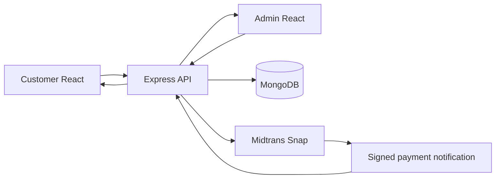
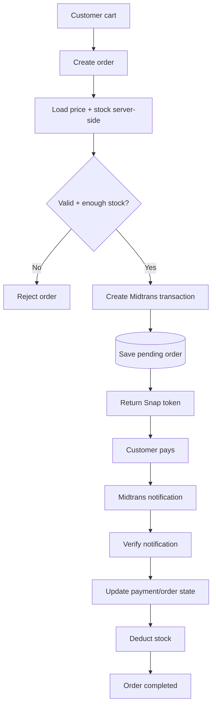
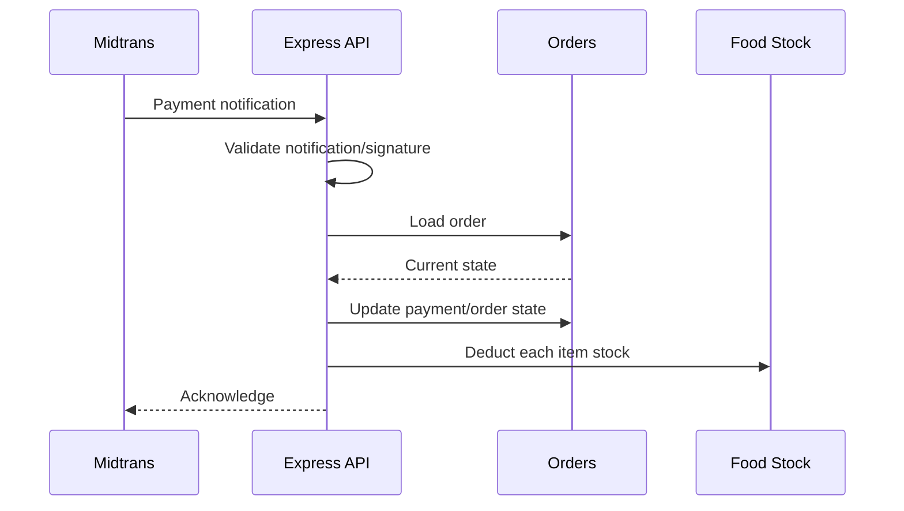
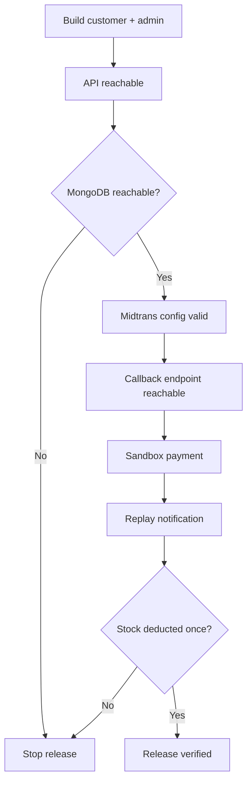

# 🍜 KantinPintar v2 — Engineering Blueprint

> **Commerce flow:** Customer + Admin React apps → Express API → MongoDB → Midtrans payment lifecycle.

**Reviewed snapshot:** `main` @ [`1188cfd98fc8`](https://github.com/HidayahMF/kantinpintarv2/commit/1188cfd98fc8bd6ed4c57b19cd1f674e7321358b) — 2026-09-17

## ⚡ System snapshot

| Layer | Implementation |
| --- | --- |
| Customer UI | React |
| Admin UI | React |
| API | Express |
| Database | MongoDB / Mongoose |
| Payments | Midtrans Snap |
| CI | No `.github/workflows/` found in reviewed snapshot |

## 🏗️ System architecture

## 🛒 Order → payment → stock journey

## 🔔 Callback sequence

> **Release-critical:** external payment events and database writes cross system boundaries. Duplicate and near-simultaneous callbacks must be treated as first-class test cases.

## 🗺️ Code ownership map

| Source | Owns |
| --- | --- |
| [`backend/server.js`](https://github.com/HidayahMF/kantinpintarv2/blob/1188cfd98fc8bd6ed4c57b19cd1f674e7321358b/backend/server.js) | API entry/runtime |
| [`backend/controllers/orderController.js`](https://github.com/HidayahMF/kantinpintarv2/blob/1188cfd98fc8bd6ed4c57b19cd1f674e7321358b/backend/controllers/orderController.js) | Order pricing, payment, state, stock |
| [`backend/middleware/authAdminMiddleware.js`](https://github.com/HidayahMF/kantinpintarv2/blob/1188cfd98fc8bd6ed4c57b19cd1f674e7321358b/backend/middleware/authAdminMiddleware.js) | Admin authorization |
| [`frontend/src/context/StoreContextProvider.jsx`](https://github.com/HidayahMF/kantinpintarv2/blob/1188cfd98fc8bd6ed4c57b19cd1f674e7321358b/frontend/src/context/StoreContextProvider.jsx) | Customer-side shared store/request state |

## 🚀 Developer → release pipeline

```mermaid
flowchart LR
    A[Change request] --> B[Trace domain owner]
    B --> C[Implement focused change]
    C --> D[Customer/Admin lint + build]
    D --> E[API smoke test]
    E --> F[Midtrans sandbox scenarios]
    F --> G[Authorization checks]
    G --> H[Concurrency/idempotency checks]
    H --> I[PR review]
    I --> J[Deploy]
    J --> K[Sandbox post-deploy smoke]
```

### Declared commands

| App | Commands |
| --- | --- |
| Backend | `npm run dev`, `npm run start` |
| Customer UI | `npm run dev`, `npm run lint`, `npm run build` |
| Admin UI | `npm run dev`, `npm run lint`, `npm run build` |

## 🛡️ Quality gates

| Gate | Must prove |
| --- | --- |
| Price integrity | Browser cannot override authoritative product pricing |
| Stock integrity | Insufficient stock is rejected safely |
| Notification trust | Invalid/tampered callbacks do not update orders |
| Idempotency | Duplicate callbacks do not deduct stock twice |
| Concurrency | Near-simultaneous callbacks do not corrupt inventory |
| Ownership | Customer reads only their own orders |
| Admin separation | Admin-only behavior stays protected |
| Payment states | Success, failure, and expiry paths behave predictably |

## ⚠️ Risk radar

| Priority | Finding | Impact |
| --- | --- | --- |
| 🔴 High | Stock deduction uses per-item writes | Partial failure/concurrency can create inconsistent inventory |
| 🔴 High | Payment + DB updates span separate systems | Exactly-once behavior is not automatic |
| 🟠 Medium | Order flag alone does not prove idempotency | Duplicate notifications still require explicit verification |
| 🟡 Low | No conventional automated test suite found | Payment regression protection depends on deliberate sandbox testing |

## 🌐 Release readiness flow

## 📌 Engineering rule

Payment success is not enough by itself. A release should prove the **entire order state + inventory effect** behaves correctly under retries and duplicate delivery.

---

### Keeping this blueprint accurate

Update the diagrams whenever order state transitions, stock deduction rules, payment callbacks, or authorization boundaries change.
