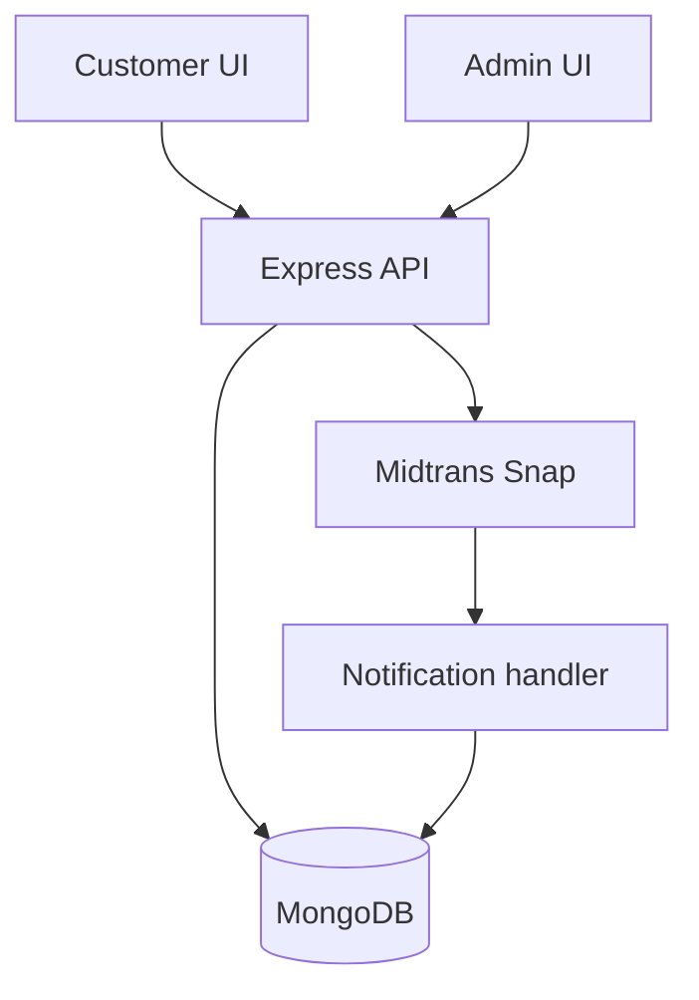

# kantinpintarv2 — Development Pipeline

Food ordering application with customer and admin React apps, an Express API, MongoDB models, and Midtrans payment integration.

> Source review: **2026-09-17**, branch `main`, commit [`1188cfd98fc8`](https://github.com/HidayahMF/kantinpintarv2/commit/1188cfd98fc8bd6ed4c57b19cd1f674e7321358b). This is a code-grounded implementation overview and development guide, not a reconstructed historical timeline or a claim that runtime tests passed.

## At a glance

| Area | Finding |
| --- | --- |
| Review scope | Repository tree, dependency manifests, and selected entry points/domain implementations linked below |
| Automated CI | No files under `.github/workflows/` in this source snapshot |
| Validation performed | Static source and documentation review; application builds, tests, databases, and external services were not executed |

## Implemented flow

1. The customer context loads menu/cart state and attaches authenticated requests; admin access is verified against the database.

2. Order creation loads food prices and stock from the database, calculates the payable amount, requests a Midtrans Snap transaction, and stores a pending order.

3. Payment status checks and signed notifications update order status and invoke stock deduction; the customer can retrieve their own orders.

### Runtime map

## Source map

Principal source files used for this overview, pinned to the reviewed commit:

- [backend/server.js](https://github.com/HidayahMF/kantinpintarv2/blob/1188cfd98fc8bd6ed4c57b19cd1f674e7321358b/backend/server.js)
- [backend/controllers/orderController.js](https://github.com/HidayahMF/kantinpintarv2/blob/1188cfd98fc8bd6ed4c57b19cd1f674e7321358b/backend/controllers/orderController.js)
- [backend/middleware/authAdminMiddleware.js](https://github.com/HidayahMF/kantinpintarv2/blob/1188cfd98fc8bd6ed4c57b19cd1f674e7321358b/backend/middleware/authAdminMiddleware.js)
- [frontend/src/context/StoreContextProvider.jsx](https://github.com/HidayahMF/kantinpintarv2/blob/1188cfd98fc8bd6ed4c57b19cd1f674e7321358b/frontend/src/context/StoreContextProvider.jsx)

## Technology and commands

Version ranges below are declarations in source manifests, not independently verified installed versions.

| Manifest | Relevant declarations |
| --- | --- |
| [admin/package.json](https://github.com/HidayahMF/kantinpintarv2/blob/1188cfd98fc8bd6ed4c57b19cd1f674e7321358b/admin/package.json) | `react ^19.1.0`, `vite ^6.3.5` |
| [backend/package.json](https://github.com/HidayahMF/kantinpintarv2/blob/1188cfd98fc8bd6ed4c57b19cd1f674e7321358b/backend/package.json) | `express ^5.1.0`, `midtrans-client ^1.4.3`, `mongoose ^8.14.1` |
| [frontend/package.json](https://github.com/HidayahMF/kantinpintarv2/blob/1188cfd98fc8bd6ed4c57b19cd1f674e7321358b/frontend/package.json) | `react ^19.0.0`, `vite ^6.3.1` |
| [package.json](https://github.com/HidayahMF/kantinpintarv2/blob/1188cfd98fc8bd6ed4c57b19cd1f674e7321358b/package.json) | See manifest |

Run each command from the indicated directory after installing the corresponding dependencies and configuring an isolated development environment. Commands are listed as declared; this review does not certify they succeed.

| Directory | Command | Implementation |
| --- | --- | --- |
| `admin` | `npm run dev` | Declared: `vite` |
| `admin` | `npm run build` | Declared: `vite build` |
| `admin` | `npm run lint` | Declared: `eslint .` |
| `backend` | `npm run start` | Declared: `node server.js` |
| `backend` | `npm run dev` | Declared: `nodemon server.js` |
| `frontend` | `npm run dev` | Declared: `vite` |
| `frontend` | `npm run build` | Declared: `vite build` |
| `frontend` | `npm run lint` | Declared: `eslint .` |

## Development sequence

| Stage | Work | Completion evidence |
| --- | --- | --- |
| 1. Establish scope | Read the source map and limitations; choose one concrete behavior to change. | Expected input, output, and failure behavior. |
| 2. Prepare environment | Use the manifests and configuration references. | Required local services reachable with synthetic data. |
| 3. Implement | Follow the implemented flow and update the layer that owns the behavior. | Focused diff with matching caller/callee contracts. |
| 4. Validate | Run applicable declared checks and the scenarios below. | Recorded commands, results, and untested dependencies. |
| 5. Review and release | Review the diff and update documentation; release after environment checks. | Reviewed change and target-environment smoke check. |

These stages are a recommended maintenance sequence, not a historical timeline.

## Configuration and runtime prerequisites

No standard example-environment, container, or test-runner configuration matched the scanned inventory. Consult the source map for runtime assumptions.

Configuration-file presence does not prove deployment success. Keep credentials outside version control and use synthetic records during setup.

## Verification plan

Use payment sandbox fixtures to verify invalid signatures, duplicate notifications, insufficient stock, price tampering, and customer/admin separation.

No conventional test files were found in the scanned tree. The scenarios above are proposed acceptance checks, not existing automated coverage.

## Known limitations and next work

Stock deduction uses per-item writes and an order flag; that does not by itself prove concurrency-safe, exactly-once processing across simultaneous callbacks. Payment and database operations span separate systems.

Prioritize the acceptance checks above before expanding the feature set. A declared test command or example test does not establish production readiness.

## Keeping this document accurate

Update the source snapshot and affected flow when entry points, persistence, authentication, or integration contracts change. Keep planned capabilities separate from implemented behavior, and record actual build/test results only after running them.
